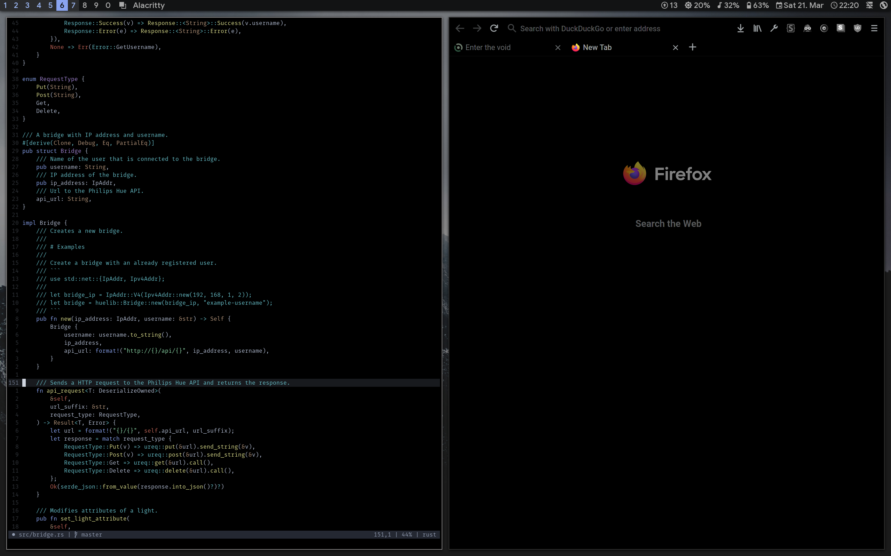

# dotfiles

+ **Operating System**: [Void Linux](https://voidlinux.org/)
+ **Window Manager**: [bspwm](https://github.com/baskerville/bspwm)
+ **Hotkey Daemon**: [sxhkd](https://github.com/baskerville/sxhkd)
+ **Compositor**: [picom](https://github.com/yshui/picom)
+ **Bar**: [Polybar](https://github.com/polybar/polybar)
+ **Terminal**: [Alacritty](https://github.com/alacritty/alacritty)
+ **Editor**: [neovim](https://github.com/neovim/neovim)

## Installation

To automatically symlink the config files install [dotutil-sh](https://github.com/yuqio/dotutil-sh) and run `dotutil -r` inside the dotfiles directory. Alternatively you can of course symlink the files manually.

## Screenshots

